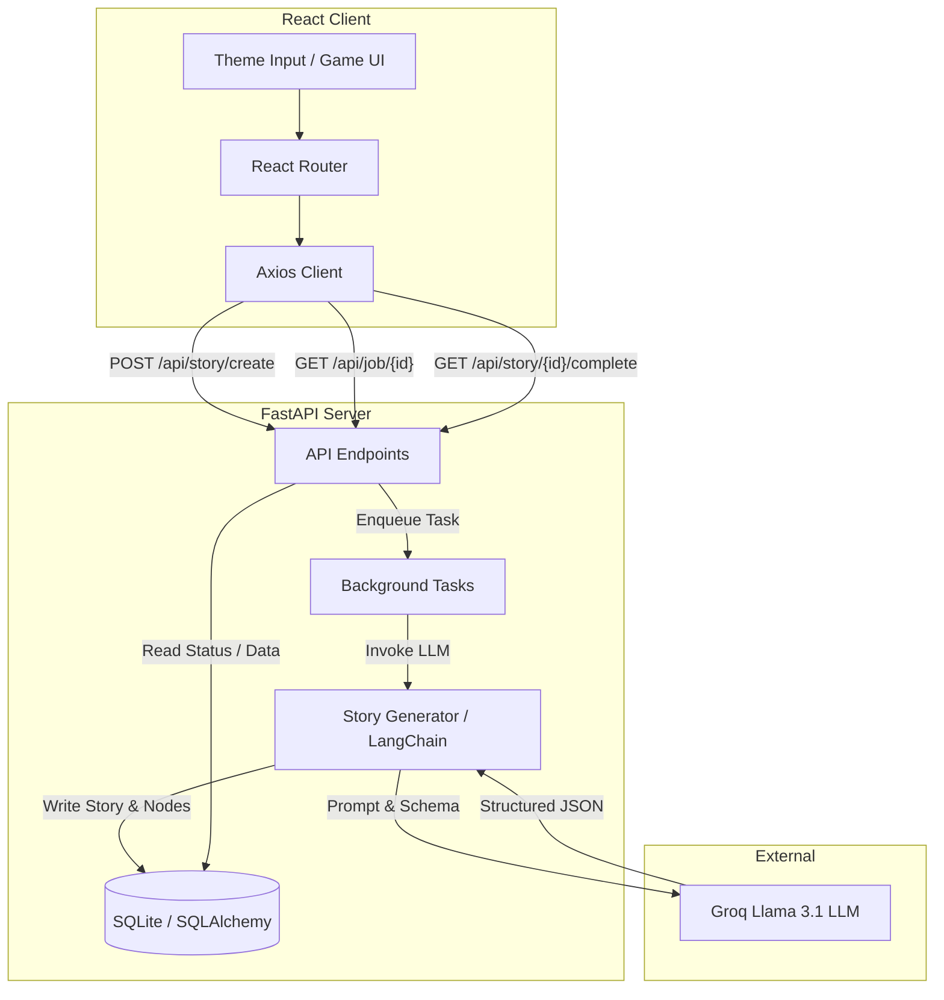

# Interactive Story Generator (Choose Your Own Adventure)

An immersive, dynamic "Choose Your Own Adventure" web application that uses artificial intelligence to generate unique, branching stories based on user-defined themes. The project is split into a **React (Vite) frontend** and a **FastAPI backend** that connects to LLMs (using LangChain & Groq) to dynamically build and save interactive story trees.

---

## 🏗️ Project Architecture

The application is designed using a client-server architecture with an asynchronous background task system for handling story generation.

### High-Level Architecture Overview



### Component Details

#### 1. Frontend (`/frontend`)
*   **React + Vite**: A modern, high-performance React application setup.
*   **React Router**: Handles navigation between the generator home page (`/`) and the active game page (`/story/:id`).
*   **StoryGenerator Component**: Sends user-selected themes to the backend, retrieves a `job_id`, and runs an active polling loop (every 5 seconds) to check status.
*   **StoryLoader Component**: Fetches the fully-constructed story tree when the background generation completes.
*   **StoryGame Component**: Implements the gameplay logic, maintaining state for the current node (`currentNodeID`) and offering options to make choices, restart the story, or spawn a new adventure.
*   **Vite Proxy**: Configured in `vite.config.js` to proxy `/api` requests to `http://localhost:8000/api`, bypassing CORS and simplifying API endpoints.

#### 2. Backend (`/backend`)
*   **FastAPI**: A high-performance web framework for building APIs.
*   **LangChain**: Integrates with LLMs to manage prompt templates and structured JSON schema output parsing.
*   **ChatGroq**: Configured to use the `llama-3.1-8b-instant` model to build rich story graphs based on a system prompt (`STORY_PROMPT`) containing instructions for choice-driven paths.
*   **Database (SQLite + SQLAlchemy)**: Saves stories and nodes to `database.db`.
    *   **Story**: Contains meta-information like title, session ID, and timestamp.
    *   **StoryNode**: Contains the narration text, choices/options (stored as a JSON field), and endings metadata (`is_ending`, `is_winning_ending`).
    *   **StoryJob**: Tracks the state of the story generator background task (`pending`, `processing`, `completed`, `failed`).
*   **Asynchronous Background Tasks**: To avoid blocking the HTTP thread, story generation is offloaded using FastAPI's `BackgroundTasks`, which generates the story tree and writes it to SQLite in the background.

---

## 🛠️ Building & Running Instructions

Follow these instructions to run both the backend and frontend servers on your local machine.

### Prerequisites
*   [Node.js](https://nodejs.org/) (v18+)
*   [Python](https://www.python.org/) (v3.10+)
*   Groq API Key (Sign up at [Groq Console](https://console.groq.com/)) or Gemini/OpenAI API Keys.

---

### 1. Backend Setup & Run

1.  **Navigate to the backend directory**:
    ```bash
    cd backend
    ```

2.  **Environment Variables**:
    Create a `.env` file in the `backend/` directory by copying the configuration or writing a new one. Ensure you fill in your API keys:
    ```ini
    DATABASE_URL=sqlite:///./database.db
    API_PREFIX=/api
    DEBUG=true
    ALLOWED_ORIGINS=http://localhost:3000,http://localhost:5173
    
    # Enter your API Keys (Groq is active by default)
    GROQ_API_KEY=your_groq_api_key_here
    GEMINI_API_KEY=your_gemini_api_key_here
    OPENAI_API_KEY=your_openai_api_key_here
    ```

3.  **Choose your Python environment setup**:

    *   **Option A: Virtualenv (Recommended standard)**
        ```bash
        # Create virtual env
        python3 -m venv .venv
        
        # Activate virtual env
        source .venv/bin/activate
        
        # Install dependencies
        pip install fastapi uvicorn sqlalchemy pydantic pydantic-settings python-dotenv langchain langchain-core langchain-groq langchain-google-genai langchain-openai
        ```

    *   **Option B: Conda**
        ```bash
        # Create and activate a conda env
        conda create -n fastAPIenv python=3.12
        conda activate fastAPIenv
        
        # Install dependencies
        pip install fastapi uvicorn sqlalchemy pydantic pydantic-settings python-dotenv langchain langchain-core langchain-groq langchain-google-genai langchain-openai
        ```

4.  **Run the Backend server**:
    ```bash
    uvicorn main:app --reload
    ```
    The backend server will start at `http://localhost:8000`. You can access the interactive API docs at `http://localhost:8000/docs`.

---

### 2. Frontend Setup & Run

1.  **Navigate to the frontend directory**:
    ```bash
    cd frontend
    ```

2.  **Install dependencies**:
    ```bash
    npm install
    ```

3.  **Run in Development Mode**:
    ```bash
    npm run dev
    ```
    The application will spin up at `http://localhost:5173`. Open this URL in your browser to play the game!

4.  **Build for Production**:
    ```bash
    npm run build
    ```
    This compiles the app into the `dist/` directory, optimized for static deployment.

---

## 🔗 API Documentation Summary

Here is a summary of the backend REST endpoints:

*   `POST /api/story/create`: Receives a story theme and enqueues a background generation job. Returns a `job_id`.
*   `GET /api/job/{job_id}`: Polls the generation job status (`pending` ➔ `processing` ➔ `completed` or `failed`).
*   `GET /api/story/{story_id}/complete`: Retrieves the fully compiled story node tree and title for gameplay.
